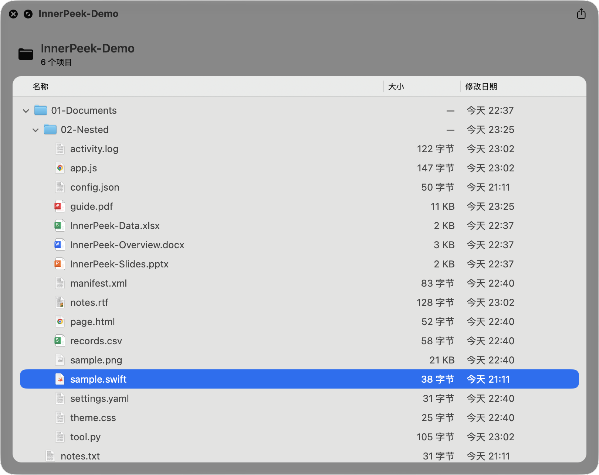
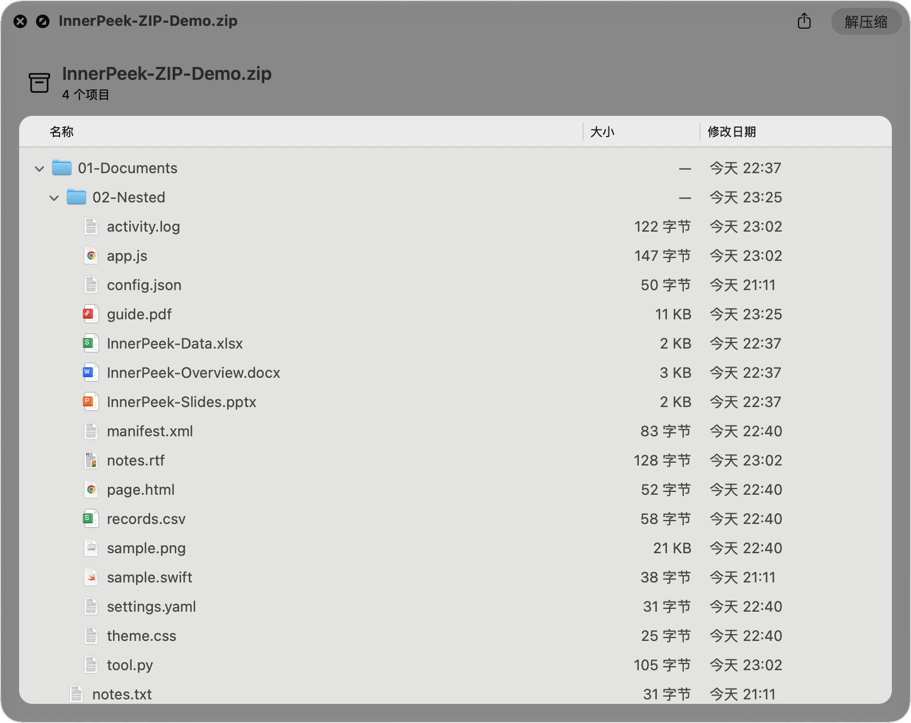

<p align="center">
  
</p>

<h1 align="center">InnerPeek</h1>

<p align="center"><strong>在 Finder 里按下空格，看清文件夹与 ZIP 的内容。</strong></p>

<p align="center">
  <a href="https://github.com/fjd2004711/InnerPeek/releases/latest">下载最新版</a> ·
  <a href="#安装">安装</a> ·
  <a href="#从源码构建">构建</a> ·
  <a href="README_EN.md">English</a>
</p>

<p align="center">
  <a href="https://github.com/fjd2004711/InnerPeek/releases/latest"></a>
  
  <a href="LICENSE"></a>
</p>

InnerPeek 是一个轻量的 macOS Quick Look 扩展。选中文件夹或 ZIP 压缩包，按下空格，即可在 Finder 的原生预览窗口中浏览目录树，无需打开新应用，也无需先解压。

## 预览

| 文件夹 | ZIP 压缩包 |
| :---: | :---: |
|  |  |

截图来自 Finder 中的实际预览。仓库还提供了可直接试用的[示例文件夹](docs/demo/InnerPeek-Demo)和[对应的 ZIP](docs/demo/InnerPeek-Demo/InnerPeek-ZIP-Demo.zip)。

## 功能

- **树形浏览**：逐层展开或收起文件夹与 ZIP 内的目录。
- **关键信息一目了然**：显示名称、文件大小、修改时间和文件类型图标。
- **ZIP 无需解压**：只读取 ZIP 的目录索引，不读取文件正文，也不在磁盘上生成解压副本。
- **内容结构提示**：基于本地规则和文件知识识别常见项目、模型包、文档集合与照片配对结构，并展示可核对的文件依据。
- **值得注意的内容**：在有限扫描范围内提示组件完整性、异常小或空的模型权重，以及明显的空间集中情况。
- **按需加载**：文件夹仅在展开时读取，系统文件图标在后台获取并缓存。
- **原生体验**：基于 Quick Look 和 AppKit `NSOutlineView`，保留 Finder 熟悉的列表交互。
- **本地且只读**：预览过程不上传内容、不修改源文件，也没有常驻后台服务。

## 系统要求

- 推荐 macOS 26 或更高版本
- Apple Silicon 或 Intel Mac

## 安装

1. 从 [GitHub Releases](https://github.com/fjd2004711/InnerPeek/releases/latest) 下载最新 DMG。
2. 打开 DMG，将 `InnerPeek.app` 拖入「应用程序」。
3. 打开一次 InnerPeek，让 macOS 注册 Quick Look 扩展。
4. 在 Finder 中选中文件夹或 ZIP，按空格开始预览。

点击文件夹整行或左侧箭头可以展开、收起目录；再次按空格即可关闭预览。

### 访问受保护的位置

普通目录不需要额外授权。若要预览桌面、文稿、下载、邮件资料或其他受 macOS 保护的位置，请前往：

**系统设置 → 隐私与安全性 → 完全磁盘访问权限 → “+” → 选择 `/Applications/InnerPeek.app` → 打开开关**

授权后重新打开 Finder 预览。完全磁盘访问并非日常使用的必需条件；InnerPeek 只用它读取你主动预览的内容。

## 工作原理

InnerPeek 的目标是缩短“按空格看一眼”的路径：

| 场景 | 实现方式 |
| --- | --- |
| 文件夹 | 首次只读取当前层级；展开子目录时再按需读取，并跳过隐藏文件。 |
| ZIP | 直接解析 central directory，在内存中建立目录树，不解压文件。 |
| 内容判断 | 仅使用已分析的文件名、类型、角色和结构规则；结论附带已分析范围内的相对路径依据。 |
| 文件图标 | 先显示轻量类型图标，再异步获取磁盘文件的 Finder 图标并缓存。 |
| 界面 | Quick Look 扩展承载原生 `NSOutlineView`，负责选择、展开和滚动。 |

这些设计避免了完整解压、一次性遍历整棵目录树以及在主线程同步查询大量图标。

内容分析完全在本机进行，由规则和知识文件驱动，保持有界且只读。它可以帮助快速理解常见结构，但不会声称理解任意文件夹，也不提供安全、病毒或恶意软件判断。

## 当前限制

- 目前只支持文件夹和普通单卷 ZIP 的目录预览。
- ZIP64 与分卷 ZIP 暂不支持；旧编码 ZIP 中的非 UTF-8 文件名可能无法正确显示。
- ZIP 内的单个文件不能在预览中打开或导出。
- 文件夹预览默认不显示隐藏文件。

InnerPeek 专注于快速确认内容结构，不替代完整的文件管理或压缩工具。

## 常见问题

<details>
<summary><strong>安装后按空格仍然看不到目录树？</strong></summary>

确认应用已经移动到「应用程序」并至少打开过一次，然后关闭当前 Quick Look 窗口再重新预览。若目标位于受保护目录，请检查完全磁盘访问权限。

</details>

<details>
<summary><strong>预览 ZIP 会产生临时解压文件吗？</strong></summary>

不会。InnerPeek 只读取 ZIP central directory 中的名称、层级、大小和日期等元数据。

</details>

<details>
<summary><strong>为什么 ZIP 中的文件图标和磁盘文件略有不同？</strong></summary>

ZIP 条目没有可交给 Finder 的真实文件路径。InnerPeek 会根据扩展名和文件类型显示并缓存系统类型图标，从而避免为图标创建临时文件。

</details>

## 从源码构建

项目没有第三方运行时依赖。

1. 克隆仓库并使用 Xcode 15 或更高版本打开 [`InnerPeek.xcodeproj`](InnerPeek.xcodeproj)。
2. 选择 `InnerPeek` scheme 和 `My Mac` 作为运行目标。
3. 如果 Xcode 提示签名问题，在两个 target 中选择你自己的开发团队。
4. 构建并运行主应用一次，然后在 Finder 中测试 Quick Look。

项目由三部分组成：

| 路径 | 作用 |
| --- | --- |
| [`InnerPeek/`](InnerPeek) | SwiftUI 设置与权限引导应用。 |
| [`InnerPeekQL/`](InnerPeekQL) | Quick Look 扩展及 AppKit 预览界面。 |
| [`Shared/`](Shared) | 文件夹与 ZIP 的只读内容提供器和共享模型。 |

推送 `v*` 标签后，[GitHub Actions](https://github.com/fjd2004711/InnerPeek/actions) 会构建 DMG、生成 `SHA256SUMS`，并发布到 Releases。

## 参与贡献

欢迎提交 [Issue](https://github.com/fjd2004711/InnerPeek/issues) 和 Pull Request。报告问题时，请附上 macOS 版本、InnerPeek 版本、文件类型和可复现步骤；请勿上传包含私人内容的文件。

如果准备实现较大的功能，建议先开 Issue 讨论范围，尤其是新的归档格式或可能影响 Quick Look 启动速度的改动。

## 许可

InnerPeek 采用 [MIT License](LICENSE)。

## 普通文件夹预览（legacy Quick Look generator）

macOS 不会把 `public.folder` 分派给 App Extension，因此普通文件夹的预览由 `Generator/` 下的 legacy generator 提供（输出 HTML，复用同一套分析引擎）。

```sh
scripts/build-generator.sh --install   # 构建、签名（ad-hoc）、安装到 ~/Library/QuickLook 并重置 Quick Look
qlmanage -p /path/to/folder            # 或在 Finder 选中文件夹后按空格
```
